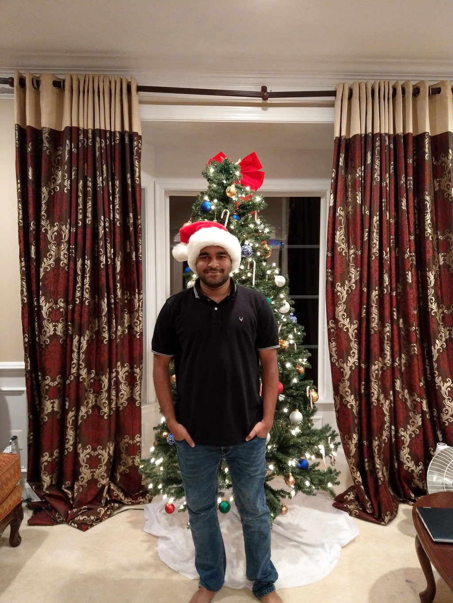

# Vinay Kumar Paspula

I live in the present with an eye on the future. My foremost dream in life is to be acknowledged and congratulated for my achievements. This craving is the fundamental inspiration in me wanting to pursue my masters at Northwest Missouri State University. In this Ever-changing universe of Computer Technology, where each new day sees a spate of new ideas and patterns rising, I need to remain on quick track. 

[Link to the image](https://github.com/vinaypaspula/assignment2-paspula/blob/main/my.jpg)

---

# Washington, D.C.

Washington, DC, the U.S. capital, is a compact city on the Potomac River, bordering the states of Maryland and Virginia. It’s defined by imposing neoclassical monuments and buildings – including the iconic ones that house the federal government’s 3 branches: the Capitol, White House and Supreme Court. 

| Location | Spending Hours | Expenditure |
| :---:    | :---:          | :---:       |
| The Lincoln Memorial | 4 | $200
|National Mall and Veterans Memorials| 6 | $150
|National Air and Space Museum| 3 | $300
|National Zoological Park | 7 | $250
 